# Wprowadzenie do sztucznej inteligencji - ćwiczenie 5

## Studenci

```
Bartłomiej Krawczyk
310774
```
```
Mateusz Brzozowski
310608
```

## Zadanie:

Proszę zaimplementować perceptron dwuwarstwowy i nauczyć go reprezentować funkcję `J : [-5,5] → R`, daną wzorem:

$$J(x) = sin(x*\sqrt{p[0]+1})+cos(x*\sqrt{p[1]+1})$$

gdzie p[0] i p[1] to najmłodsze cyfry numerów indeksów wykonawców.


W sprawozdaniu powinny znaleźć się wykresy funkcji aproksymowanej i jej aproksymacji. Powinny również znaleźć się wskaźniki jakości aproksymacji.

## Pytania:

Jak liczba neuronów w warstwie ukrytej wpływa na jakość aproksymacji?

## Odpowiedzi

- funkcja czerwona - funkcja aproksymowana
- funkcja niebieska - funkcja aproksymacji

Parametry dla najlepszego wyniku:
- liczba neuronow: `13`
- Liczba epok: `5000`
- rozmiar mini zbioru: `100`
- learning rate: `0.1`

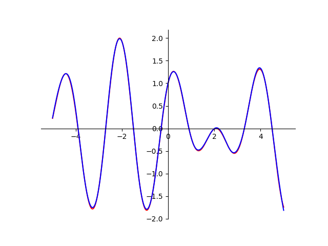

1. Wpływ liczby neurownów w warstwie ukrytej na jakość aproksymacji

Parametry:
- Liczba epok: `1000`
- rozmiar mini zbioru: `200`
- learning rate: `0.1`

l. neuronów | jakość aproksymacji  | wykres
------------|----------------------|-------
 1          | 0.9626108158771487   | 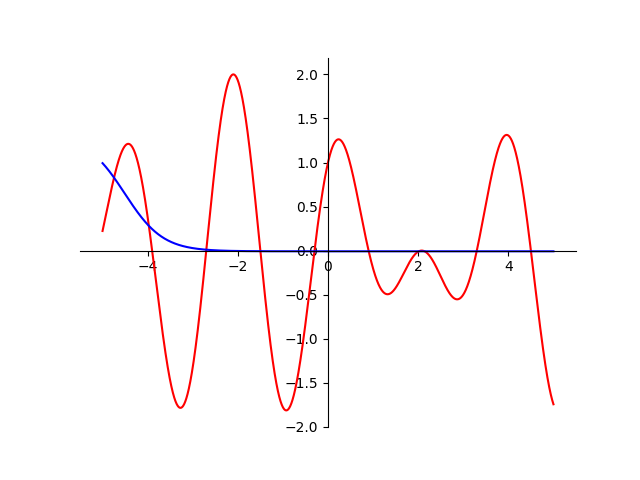
 3          | 0.5052205935619043   | 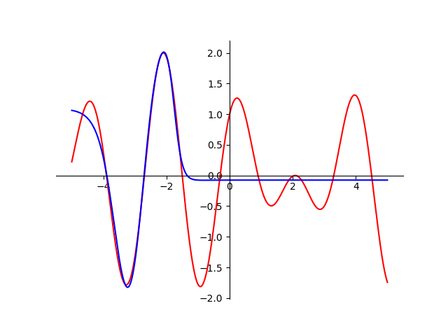
 6          | 0.20932076027426308  | 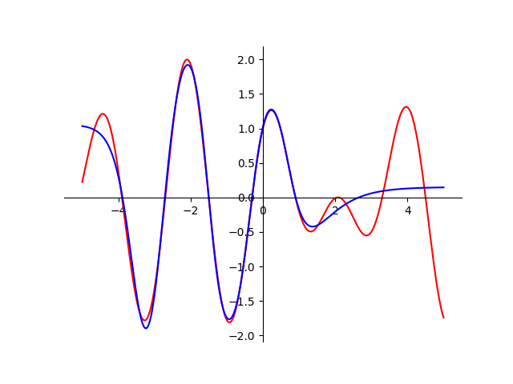
 9          | 0.028579552869285273 | 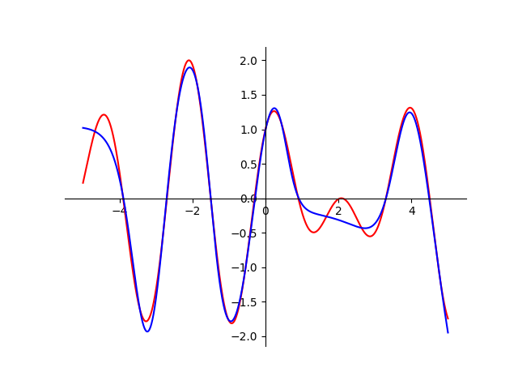
 13         | 0.02101232492836344  | 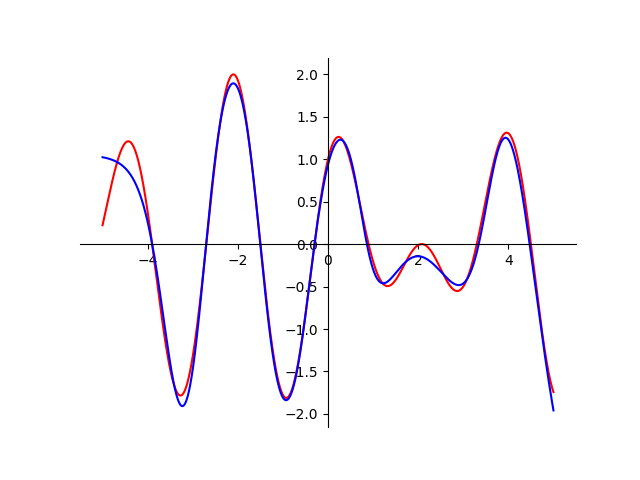
 20         | 0.04631622547961368  | 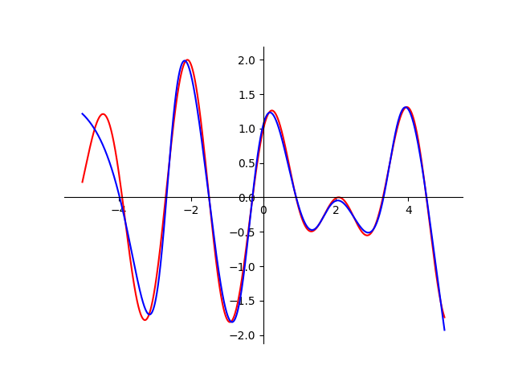
 50         | 0.026904497018995624 | 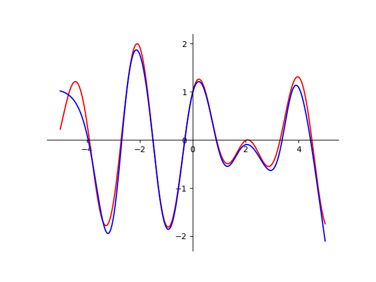

 Jak widzimy kiedy zwiększamy liczbę neuronów w warstwie ukrytej, to zwiększa się jakoś aproksymacji. Dla niewielkich wartości `1`,`3`,`6`,`9`, przy zwiększaniu liczby nauronów jakość aproksymacji się popprawia w sposób znaczący. Jednakże po osiągnięciu najlepszej jakości, nie następuje dalsze polepszanie się wyniku, wręcz przeciwnie jesteśmy w stanie zauważyć pogorszenie się jakości wyników. Tak więc, im więcej nie oznacza lepiej, należy dobrać odpowiednią liczbę, nie za dużą, tak żeby nie wsytąpił efekt przeuczenia, ale też i nie za małą.


2. Wpływ liczby epok na jakość aproksymacji

Parametry:
- liczba neuronow: `13`
- rozmiar mini zbioru: `100`
- learning rate: `0.1`

l. epok | jakość aproksymacji  | wykres
--------|----------------------|-------
 100    | 0.6036005131793474   | 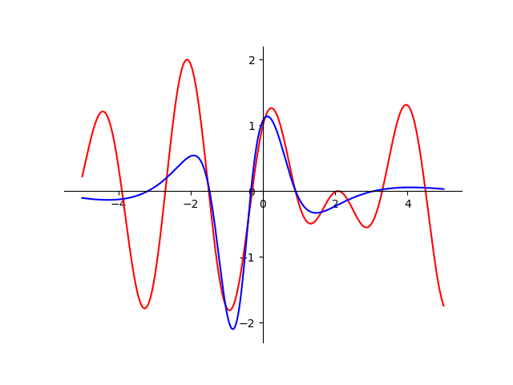
 500    | 0.025507866058764903 | 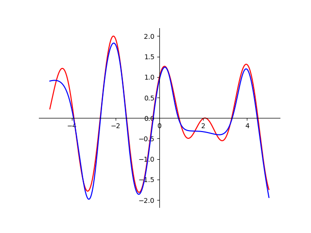
 1000   | 0.003881639756722564 | 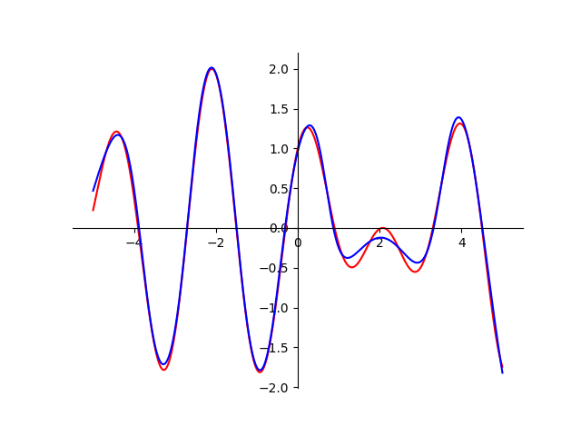
 2500   | 0.000464653486408472 | 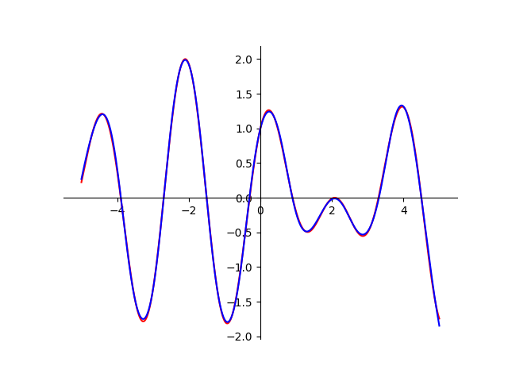
 3000   | 0.000371961012552506 |
 4000   | 0.000710141625934429 |
 5000   | 0.000500152100903829 | 

 Jak widzimy w tym przypadku im więcej tym lepiej, jednakże po przekroczeniu pewnego progu wyniki, nie ulegają poprawie, tylko utrzymują się na pewnym poziomie jakości aproksymacji.

3. Wpływ rozmiaru mini zbioru na jakość aproksymacji

Parametry:
- liczba neuronow: `13`
- Liczba epok: `1000`
- learning rate: `0.1`

r. min zbioru | jakość aproksymacji  | wykres
--------------|----------------------|-------
 5            | 0.742208769993701    | 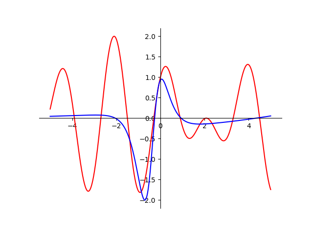
 10           | 0.7329583312672093   | 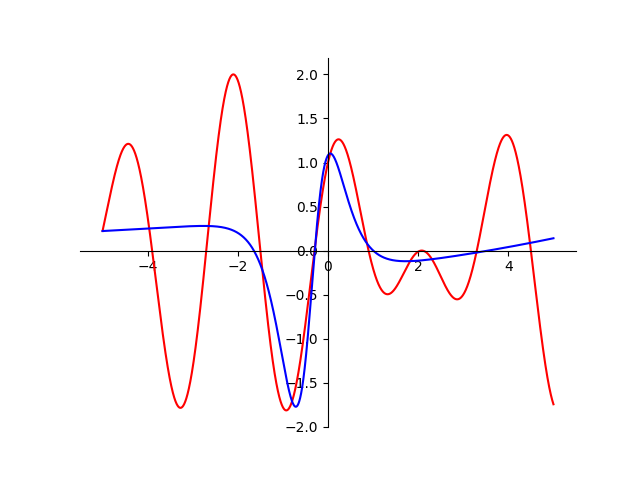
 25           | 0.00146432025873798  | 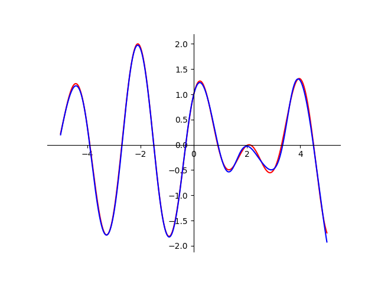
 50           | 0.000609914994377384 | 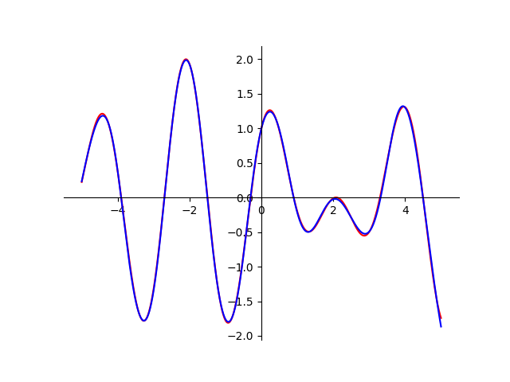
 100          | 0.005854738926109195 | 
 200          | 0.02101232492836344  | 


Dla poszczególnych parametrów musimy odnaleść odpowiedni rozmiar mini zbioru, ponieważ za duży rozmiar lub za mały, negatwynie wpływa na jakość aproksymacji.

4. Wpływ learning rate na jakość aproksymacji

Parametry:
- liczba neuronow: `13`
- Liczba epok: `1000`
- rozmiar zbioru: `100`

learning rate | jakość aproksymacji  | wykres
--------------|----------------------|-------
 0.2          | 0.01651475725734568  | 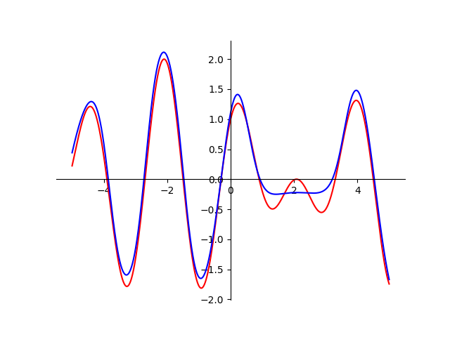
 0.1          | 0.005854738926109195 | 
 0.01         | 0.6692954914503615   | 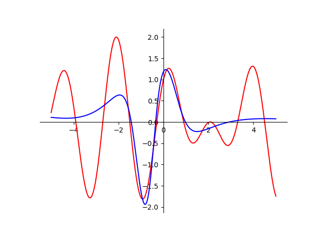
 0.001        | 0.985174553192548    | 


Im mniejszy lerning rate, tym mniejsza jakosć aproksymacji, jednakże jest to spowodowane tym, że na stałym poziomy pozostają inne parametry i w teorii powinna nam się zwiększać dokładkość, ponieważ robimy małe, bardziej dokładne skoki, ale żeby taki stan osiągnąć powinniśmy znacząco zwiększyć liczbę epok.

<script type="text/javascript" src="http://cdn.mathjax.org/mathjax/latest/MathJax.js?config=TeX-AMS-MML_HTMLorMML"></script>
<script type="text/x-mathjax-config">
        MathJax.Hub.Config({ tex2jax: {inlineMath: [['$', '$']]}, messageStyle: "none" });
</script>