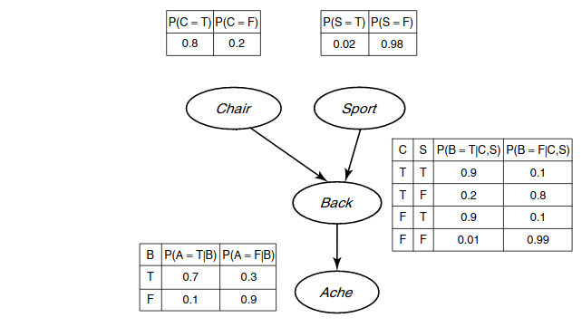

# Wprowadzenie do sztucznej inteligencji - ćwiczenie 7

## Student

```
Bartłomiej Krawczyk
310774
```

## Zadanie:

Proszę zaimplementować losowy generator danych, który działa zgodnie z rozkładem reprezentowanym przez daną sieci bayesowską.



Sieć ta opisuje zależności między (zero-jedynkowymi) zmiennymi losowymi i dana jest w postaci opisu grafu połączeń oraz tabel prawdopodobieństw warunkowych.
Wejście algorytmu:
- ile przykładów wygenerować,
- opis struktury prostej sieci (według własnego formatu)
- tabele prawdopodobieństw należy wczytać z pliku tekstowego.
Wyjście:
- plik tekstowy z przykładami.

Strukturę sieci i tabele prawdopodobieństw widać na rysunku. Klasa to „Ache” (czy bolą plecy), pozostałe węzły to atrybuty („Back” to uszkodzenie kręgosłupa (drobne, czasem nie skutkujące bólem)). Wytworzony zbiór podzielić i użyć do treningu i testowania klasyfikatora utworzonego na wcześniejszych ćwiczeniach. Jakie uzyskuemy wyniki? Wnioski?

# Teoria
Wyliczone częstości wystąpień dla podanego przykładu:

Chair
```
4 / 5 = 0.8
```
Sport
```
1 / 50 = 0.02
```
Back
```
0.8 * 0.02 * 0.9 + 0.8 * 0.98 * 0.2 + 0.2 * 0.02 * 0.9 + 0.2 * 0.98 * 0.01
= 4419 / 25000 = 0.17676
```
Ache
```
(0.8 * 0.02 * 0.9 + 0.8 * 0.98 * 0.2 + 0.2 * 0.02 * 0.9 + 0.2 * 0.98 * 0.01) * 0.7 + (1 - (0.8 * 0.02 * 0.9 + 0.8 * 0.98 * 0.2 + 0.2 * 0.02 * 0.9 + 0.2 * 0.98 * 0.01)) * 0.1
= 25757 / 125000
= 0.206056
```

# Wyniki

name  | frequency
------|----------
Chair | 0.80154
Sport | 0.02004
Back  | 0.17775
Ache  | 0.20579

# Wyniki klasyfikatora ID3

## Macierz Pomyłek:

expected / predicted | T   | F
---------------------|-----|-----
T                    | 499 | 304
F                    | 205 | 2992

## Dokładność:

name | min     | mean     | max      | stdev
-----|---------|----------|----------|----------------------
Ache | 85.95 % | 86.974 % | 87.925 % | 0.49531555598426313 %